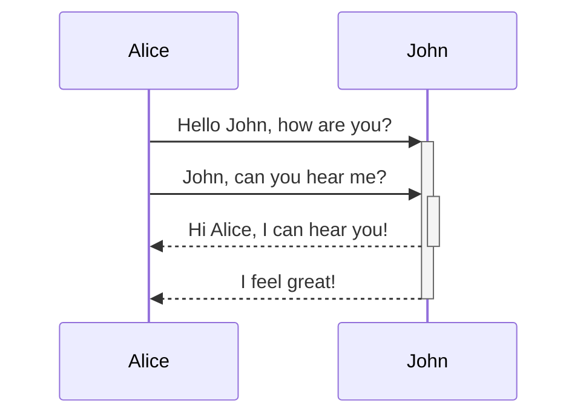
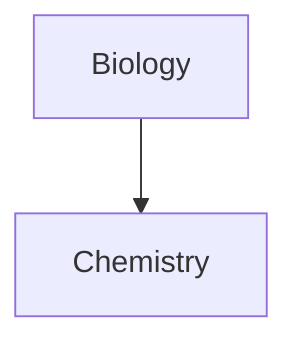

## Shortcuts
==Cmd + E== toggle between edit and preview mode
==Cmd + Enter== to toggle a checkbox
==Cmd + Shift + F== to search in all files
==Cmd + ] or [== : to change the indentation

Tag: #essential/format
## Source
[Obsidian format notes](https://help.obsidian.md/How+to/Format+your+notes)
### Embeds

Embed another file (read more about [Embed files](https://help.obsidian.md/How+to/Embed+files)). Here's an embedded section:

```markdown
![[Obsidian#What is Obsidian]]
```

## What is Obsidian

Obsidian is a both a Markdown editor and a knowledge base app.

Used in the most basic way, you can edit and preview Markdown files. But its true power lies in managing densely networked knowledge base.

How do we start creating a network, you ask? Let's first start making some [internal links](https://help.obsidian.md/How+to/Internal+link)!

### Headers

```markdown
# This is a heading 1
## This is a heading 2
### This is a heading 3 
#### This is a heading 4
##### This is a heading 5
###### This is a heading 6
```

# This is a heading 1

## This is a heading 2

### This is a heading 3

#### This is a heading 4

##### This is a heading 5

###### This is a heading 6


### Emphasis

```markdown
*This text will be italic*
_This will also be italic_
```

*This text will be italic*

_This will also be italic_

```markdown
**This text will be bold**
__This will also be bold__
```

**This text will be bold**  
**This will also be bold**

```markdown
_You **can** combine them_
```

_You **can** combine them_

### Lists

```markdown
- Item 1
- Item 2
  - Item 2a
  - Item 2b

1. Item 1
1. Item 2
1. Item 3
   1. Item 3a
   1. Item 3b
```

-   Item 1
-   Item 2
    -   Item 2a
    -   Item 2b

1.  Item 1
2.  Item 2
3.  Item 3
    1.  Item 3a
    2.  Item 3b

### Images

```

```


#### Resizing images

Example of this above image resized to 100 pixels wide:

```

```


### Links
 Link to a specific heading in the note [[Format your notes - Obsidian Help#Links]]
#### External links

Markdown style links can be used to refer to either external objects, such as web pages, or an internal page or image.

```markdown
http://obsidian.md - automatic!
[Obsidian](http://obsidian.md)
```
http://obsidian.md - automatic!
[Obsidian](http://obsidian.md)
#### Obsidian URI links

[Obsidian URI](https://help.obsidian.md/Advanced+topics/Using+obsidian+URI) links can be used to open notes in Obsidian either from another Obsidian vault or another program.

For example, you can link to a file in a vault like so (please note the [required encoding](https://help.obsidian.md/Advanced+topics/Using+obsidian+URI#Encoding)):

```markdown
[Link to note](obsidian://open?path=D:%2Fpath%2Fto%2Ffile.md)
```

You can link to a note by its vault name and file name instead of path as well:

```markdown
[Link to note](obsidian://open?vault=MainVault&file=MyNote.md)
```
[Link to note](obsidian://open?vault=MainVault&file=MyNote.md)
#### Escaping

If there are spaces in the url, they can be escaped by either using `%20` as a space, such as:

```markdown
[Export options](Pasted%20image)
```

Or you can enclose the target in `<>`, such as:

```markdown
[Slides Demo](<Slides Demo>)
```

### Blockquotes

```markdown
> Human beings face ever more complex and urgent problems, and their effectiveness in dealing with these problems is a matter that is critical to the stability and continued progress of society.

\- Doug Engelbart, 1961
```

> Human beings face ever more complex and urgent problems, and their effectiveness in dealing with these problems is a matter that is critical to the stability and continued progress of society.

\- Doug Engelbart, 1961

### Inline code

```markdown
Text inside `backticks` on a line will be formatted like code.
```

Text inside `backticks` on a line will be formatted like code.

### Code blocks

Syntax highlight is supported with the language specified after the first set of backticks. We use prismjs for syntax highlighting, a list of supported languages can be found [at their site](https://prismjs.com/#supported-languages)

```js
function fancyAlert(arg) {
  if(arg) {
    $.facebox({div:'#foo'})
  }
}
```

```python
import numpy as np
import pandas as pd

```

```markdown
	Text indented with a tab is formatted like this, and will also look like a code block in preview. 
```

```
Text indented with a tab is formatted like this, and will also look like a code block in preview. 
```

### Task list

```
- [x] #tags, [links](), **formatting** supported
- [x] list syntax required (any unordered or ordered list supported)
- [x] this is a complete item
- [?] this is also a complete item (works with every character)
- [ ] this is an incomplete item
- [ ] tasks can be clicked in Preview to be checked off
```

- [x] #tags, [links](), **formatting** supported
- [x] list syntax required (any unordered or ordered list supported)
- [x] this is a complete item
- [ ] this is also a complete item (works with every character)
- [ ] this is an incomplete item
- [ ] tasks can be clicked in Preview to be checked off

### Tables

You can create tables by assembling a list of words and dividing them with hyphens `-` (for the first row), and then separating each column with a pipe `|`:

```
First Header | Second Header
------------ | ------------
Content from cell 1 | Content from cell 2
Content in the first column | Content in the second column
```

| First Header | Second Header |
| --- | --- |
| Content from cell 1 | Content from cell 2 |
| Content in the first column | Content in the second column |

```
Tables can be justified with a colon | Another example with a long title
:----------------|-------------:
because of the `:` | these will be justified
```

| Tables can be justified with a colon | Another example with a long title |
| --- | --- |
| because of the `:` | these will be justified |

If you put links in tables, they will work, but if you use Piped Links, the pipe must be escaped with a `\` to prevent it being read as a table element.

```markdown
First Header | Second Header
------------ | ------------
[[Format your notes\|Formatting]]|  [[Keyboard shortcuts\|hotkeys]]
```

### Strikethrough

```markdown
Any word wrapped with two tildes (like ~~this~~) will appear crossed out.
```

Any word wrapped with two tildes (like ~~this~~) will appear crossed out.

### Highlighting

```markdown
Use two equal signs to ==highlight text==.
```

Use two equal signs to ==highlight text==.

### Horizontal Bar

```markdown
Use three stars ***, minuses ---, or underscores ___ in a new line to produce an horizontal bar.

```
***
---
___
### Footnotes

```markdown
Here's a simple footnote,[^1] and here's a longer one.[^bignote]

[^1]: meaningful!

[^bignote]: Here's one with multiple paragraphs and code.

    Indent paragraphs to include them in the footnote.

    `{ my code }`

    Add as many paragraphs as you like.
```

Here's a simple footnote[^1] 

[^1]:  the Simple note

and here's a longer one.[^bignote] 

[^bignote]: Here's one with multiple paragraphs and code. Indent paragraphs to include them in the footnote. `{ my code }` Add as many paragraphs as you like.

```markdown
You can also use inline footnotes. ^[notice that the carat goes outside of the brackets on this one.]
```

You can also use inline footnotes.^[notice that the carat goes outside of the brackets on this one.]

### Math

```markdown
$$\begin{vmatrix}a & b\\
c & d
\end{vmatrix}=ad-bc$$
```
$$\begin{vmatrix}a & b\\
c & d
\end{vmatrix}=ad-bc$$

You can also do inline math like ${x^y}^z$ or $\sum_{i=0}^n i^2 = \frac{(n^2+n)(2n+1)}{6}$

Obsidian uses [Mathjax](http://docs.mathjax.org/en/latest/basic/mathjax.html). You can check which packages are supported in Mathjax [here](http://docs.mathjax.org/en/latest/input/tex/extensions/index.html).

### Comments

Use `%%` to enclose comments, which will be parsed as Markdown, but will not show up in the preview.

```markdown
Here is some inline comments: %% Ahmad, You can't see this text%% (Can't see it)

Here is a block comment:
%%
It can span
multiple lines
%%
```

Here is some inline comments: %%Ahmad, You can't see this text%%  

Here is a block comment: 
%% Hello Ahmad, 
It can span multiple lines 
%%

## Callouts

Use the following syntax to denote a callout block: `> [!INFO]`.

Learn more about callouts [here](https://help.obsidian.md/How+to/Use+callouts).

```
> [!INFO]
> Here's a callout block.
> It supports **markdown** and [[Internal link|wikilinks]].
```

Here's a callout block.  
It supports **markdown** and [wikilinks](https://help.obsidian.md/How+to/Internal+link).

### Diagram

````

````


Obsidian supports linking to notes in Mermaid:

````

````

An easier way to do it is the following:

````

````

This way, all the note names (at least until `Z[note name]`) are all automatically assigned the class `internal-link` when you use this snippet.

If you use special characters in your note names, you need to put the note name in double quotes.  
`"⨳ special character"`  
It looks like this if you follow the [second option](https://help.obsidian.md/How+to/Format+your+notes#^376b9d):  
`A["⨳ special character"]`


